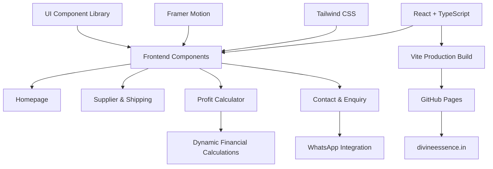

## ⚡ Tech Stack & Integrations

Divine Essence is designed as a modern, responsive B2B e-commerce sourcing and logistics platform.

### 🛠️ Frontend Technologies

<div align="center">


</div>

### 🎨 UI, Animation & Icons

<div align="center">


</div>

### 🔗 Integrations & Deployment

<div align="center">


</div>

---

## 🧩 Technology Overview

| Technology | Purpose |
|---|---|
| React.js | Component-based frontend architecture |
| TypeScript | Type-safe application development |
| JavaScript | Interactive website functionality |
| Tailwind CSS | Responsive utility-based styling |
| Vite | Development server and production builds |
| Framer Motion | UI animations and transitions |
| Lucide React | Modern SVG icon components |
| shadcn/ui | Reusable interface components |
| Radix UI | Accessible interactive primitives |
| React Hooks | State and lifecycle management |
| GitHub | Source code version control |
| GitHub Pages | Static frontend hosting |
| WhatsApp Integration | Direct business enquiry communication |

---

## 🏗️ Application Architecture



---

## 🚀 Local Development

### 1. Clone the Repository

```bash
git clone https://github.com/wingscorporate/Divine-Essence.git
```

### 2. Navigate to the Project

```bash
cd Divine-Essence
```

### 3. Install Dependencies

```bash
npm install
```

### 4. Start the Development Server

```bash
npm run dev
```

### 5. Create a Production Build

```bash
npm run build
```

### 6. Preview the Production Build

```bash
npm run preview
```

**Note:** These commands assume the project uses Vite and has the corresponding npm scripts configured.
