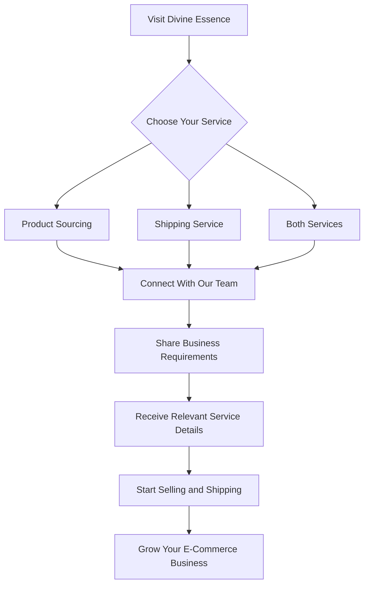

<div align="center">

# ✦ DIVINE ESSENCE ✦

### B2B Product Sourcing • Pan-India Shipping • E-Commerce Growth


<br/>

**Your Complete Product Sourcing & Logistics Growth Partner**

<a href="https://divineessence.in">

</a>

<a href="https://wa.me/919230554211">

</a>

<a href="https://wingscorporate.github.io/Divine-Essence/">

</a>

<br/><br/>


</div>

---

## 🚀 About Divine Essence

**Divine Essence** is a B2B e-commerce sourcing and logistics platform designed to help Indian online sellers build, manage, and scale their businesses.

We connect entrepreneurs with competitively priced products and affordable nationwide shipping solutions.

Whether you are launching your first dropshipping store or scaling an established D2C brand, Divine Essence is built to simplify sourcing and logistics.

### Our Mission

> To make product sourcing and shipping more affordable, accessible, and efficient for Indian e-commerce entrepreneurs.

### Our Vision

> To build a reliable sourcing and logistics ecosystem that helps online businesses scale sustainably.

---

## 💎 Our Core Services

<table>
<tr>
<td width="50%" align="center">

### 📦 Product Sourcing

**Competitive Product Supply**

Access trending and winning product opportunities suitable for Indian e-commerce.

**Highlights**

- Trending product opportunities
- Competitive supplier pricing
- Selected sourcing range ₹80–₹200
- Market-focused product selection
- Wholesale sourcing assistance
- Business-oriented supplier support
- Private product catalogue access

<a href="https://divineessence.in/#supplier">

</a>

</td>
<td width="50%" align="center">

### 🚚 Pan-India Shipping

**Affordable Logistics Solutions**

Explore competitive shipping solutions through multiple courier networks.

**Highlights**

- Shipping starting from ₹59
- ₹0 RTO courier charges on eligible plans
- Pan-India coverage
- Multiple courier options
- COD-friendly solutions
- Shipping tracking support
- Seller-focused logistics assistance

<a href="https://divineessence.in/#shipping">

</a>

</td>
</tr>
</table>

---

## 📊 Business Highlights

<div align="center">

| 📦 Sourcing | 🚚 Shipping | 🔄 RTO | 🌍 Coverage |
|:---:|:---:|:---:|:---:|
| **₹80–₹200** | **From ₹59** | **₹0*** | **Pan India** |
| Selected Products | Applicable Plans | Eligible Plans | Nationwide Network |

<br/>

**Flexible Business Model**

`PRODUCTS ONLY` • `SHIPPING ONLY` • `BOTH SERVICES`

</div>

> **Note:** All prices and terms are indicative. Actual service charges depend on product category, courier, shipment specifications, delivery location, and applicable business plans.

---

## 🖥️ Website Features

The Divine Essence website is designed as a modern, responsive, business-focused platform.

### 🎨 UI & UX

- Premium dark-themed design with gradients
- Orange accent highlights
- Responsive desktop, tablet, and mobile layouts
- Smooth section transitions
- Interactive hover effects
- Animated statistics and feature presentation
- Smooth-scrolling navigation
- Clear call-to-action buttons
- Modern cards and pricing layouts
- Mobile-friendly interface

### ⚙️ Functional Features

- Interactive Profit Calculator
- Monthly Revenue & Expense Projections
- Dynamic Profit Margin Calculation
- Supplier Service Information
- Logistics Service Information
- Courier Partner Marquee
- Seller Testimonials
- Interactive FAQ
- Seller Enquiry Form
- WhatsApp Contact Integration
- Four-Step Seller Onboarding
- Business Comparison Tables
- Legal and Policy Sections

---

## 🧮 Interactive Profit Calculator

One of the primary features of Divine Essence is its interactive profitability calculator.

It helps sellers estimate revenue, expenses, delivered orders, RTO impact, and potential monthly profits.

### Calculator Inputs

| Input | Description |
|---|---|
| Selling Price | Customer retail selling price |
| Product Cost | Supplier sourcing cost |
| Shipping Cost | Courier shipping charge |
| RTO Percentage | Expected return-to-origin rate |
| Advertising Cost | Advertising cost per attempted order |
| Packaging Cost | Packaging and miscellaneous cost |
| Monthly Orders | Estimated number of monthly orders |
| Other Charges | Optional additional business expenses |

### Profit Calculation Logic

```javascript
// Total monthly orders
const totalOrders = 300;

// RTO orders
const rtoOrders = Math.round(
  totalOrders * (rtoPercentage / 100)
);

// Successfully delivered orders
const deliveredOrders = totalOrders - rtoOrders;

// Revenue from delivered orders
const totalRevenue =
  deliveredOrders * sellingPrice;

// Product cost: Delivered orders only
const totalProductCost =
  deliveredOrders * productCost;

// Shipping cost: Delivered orders only
const totalShippingCost =
  deliveredOrders * shippingCost;

// RTO courier charge: Eligible plan
const totalRtoCharges = 0;

// Advertising cost: All attempted orders
const totalAdvertisingCost =
  totalOrders * advertisingCostPerOrder;

// Packaging cost: Delivered orders only
const totalPackagingCost =
  deliveredOrders * packagingCostPerOrder;

// Total estimated expenses
const totalExpenses =
  totalProductCost +
  totalShippingCost +
  totalRtoCharges +
  totalAdvertisingCost +
  totalPackagingCost +
  totalOtherExpenses;

// Monthly profit
const monthlyProfit =
  totalRevenue - totalExpenses;

// Profit margin
const profitMargin =
  totalRevenue > 0
    ? (monthlyProfit / totalRevenue) * 100
    : 0;
```

### 📈 Example Monthly Projection

**Scenario: 300 Monthly Orders | 50% RTO**

| Particulars | Amount |
|---|---:|
| Total Orders | 300 |
| Expected RTO Orders | 150 |
| Successfully Delivered Orders | 150 |
| Selling Price | ₹499 |
| Product Cost Per Delivered Order | ₹141 |
| Shipping Cost Per Delivered Order | ₹59 |
| Advertising Cost Per Order | ₹50 |
| Total Gross Revenue | ₹74,850 |
| Total Product Cost | ₹21,150 |
| Total Shipping Cost | ₹8,850 |
| Total Advertising Cost | ₹15,000 |
| Total RTO Courier Charges | ₹0 |
| **Total Estimated Expenses** | **₹45,000** |
| **Estimated Monthly Profit** | **₹29,850** |
| **Estimated Profit Margin** | **39.88%** |

**Important Calculation Rule**

Product Cost, Shipping Cost, and Gross Revenue are calculated using successfully delivered orders only.

RTO orders are excluded from these three calculations under the calculator's simplified model.

Advertising expenses are calculated across all attempted orders.

Actual expenses may differ due to outbound courier charges, nonrecoverable inventory costs, refunds, payment fees, and other operational factors.

---

## 🚛 Shipping & Logistics Network

Divine Essence provides access to a broad logistics ecosystem through available courier and shipping arrangements.

### Featured Logistics Companies

| | | |
|---|---|---|
| Delhivery | Blue Dart | Xpressbees |
| Ecom Express | DTDC | Ekart Logistics |
| Shadowfax | India Post | Amazon Shipping |
| DHL Express India | Additional Networks | Regional Couriers |

### Logistics Features

- Nationwide shipping support
- Multiple courier choices
- Shipment tracking
- COD shipping assistance
- RTO-focused cost optimization
- Courier allocation support
- Seller-oriented logistics assistance

> Courier logos and names are the property of their respective owners. Availability and partnership status are subject to actual business arrangements.

---

## 🔄 How Divine Essence Works



### Four-Step Onboarding

**01. Choose Your Service**

Select product sourcing, shipping, or both.

**02. Connect With Our Team**

Share your business details and requirements.

**03. Receive Service Access**

Explore relevant product opportunities and logistics arrangements.

**04. Start Selling & Shipping**

Begin operations and focus on scaling your business.

---

## 👥 Who Is Divine Essence For?

<table>
<tr>
<td>

**🛍️ Dropshippers**

Product sourcing and fulfilment support.

</td>
<td>

**🏬 Shopify Store Owners**

Reliable supplier and courier assistance.

</td>
</tr>
<tr>
<td>

**📱 Instagram Sellers**

Nationwide shipping for social commerce.

</td>
<td>

**🏢 D2C Brands**

Business-focused logistics and sourcing.

</td>
</tr>
<tr>
<td>

**📦 Marketplace Sellers**

Additional sourcing and courier options.

</td>
<td>

**🚀 New Entrepreneurs**

Support for launching an online business.

</td>
</tr>
</table>

---

## 🧩 Website Architecture

```text
Divine-Essence/
│
├── Homepage
│   ├── Hero Section
│   ├── Business Statistics
│   └── Primary CTA
│
├── Product Supplier
│   ├── Sourcing Details
│   ├── Product Benefits
│   └── Supplier Enquiry
│
├── Shipping Services
│   ├── Shipping Rates
│   ├── RTO Benefits
│   └── Courier Information
│
├── Profit Calculator
│   ├── Order Inputs
│   ├── RTO Calculation
│   ├── Unit Economics
│   └── Monthly Projection
│
├── Logistics Partners
│   └── Animated Logo Marquee
│
├── How It Works
│   └── Four-Step Process
│
├── Customer Testimonials
│
├── Frequently Asked Questions
│
├── Contact & Onboarding
│   ├── Business Enquiry Form
│   └── WhatsApp Integration
│
└── Footer
    ├── Services
    ├── Company
    └── Legal Policies
```

*This diagram illustrates the functional website structure, not an exact source-code directory listing.*

---

## ✨ Animations & Interactive Experience

The website's design includes or targets the following interactive experiences:

| Animation | Purpose |
|---|---|
| Smooth Scrolling | Seamless section navigation |
| Hover Effects | Interactive cards and buttons |
| Gradient Effects | Premium visual presentation |
| Logo Marquee | Continuous courier logo display |
| Responsive Transitions | Smooth layout interactions |
| Expandable FAQ | Interactive question-and-answer sections |
| Dynamic Calculator | Instant financial recalculations |
| Interactive CTA | Clear navigation to contact and services |

### GitHub README Animations

This README uses GitHub-compatible elements including:

- Animated typing SVG
- Dynamic status badges
- GitHub Mermaid flowchart
- Responsive HTML tables
- Service links
- WhatsApp contact links

GitHub sanitizes most custom HTML styling, CSS, and JavaScript in README files. Therefore, interactive website animations cannot be executed directly inside the README.

---

## 🔐 Security & Administration

Divine Essence is an informational B2B website and does not require customer account registration.

### Access Structure

**Public Visitors**

- Browse service details
- Use the Profit Calculator
- Review shipping information
- Read FAQs
- Submit business enquiries
- Contact the Divine Essence team

**Authorized Administrators**

Administrative functionality, where deployed, should use secure authentication.

### Recommended Security Measures

- HTTPS-enabled website
- Secure administrative authentication
- Server-side credential verification
- Protected administrative APIs
- Secure form submission handling
- Input validation
- Protection against spam
- Secure management of customer information
- No exposed passwords or API secrets in public repositories

---

## 🌐 Website Deployment

**Production Website**

https://divineessence.in

**GitHub Pages Preview**

https://wingscorporate.github.io/Divine-Essence/

**GitHub Repository**

https://github.com/wingscorporate/Divine-Essence

### Deploy Using GitHub Pages

1. Open the GitHub repository.
2. Navigate to `Settings`.
3. Select `Pages`.
4. Configure the deployment branch and folder.
5. Save the deployment settings.
6. Add your custom domain.
7. Configure the required DNS records.
8. Enable HTTPS once available.

### Custom Domain DNS

For the root domain:

```text
A    @    185.199.108.153
A    @    185.199.109.153
A    @    185.199.110.153
A    @    185.199.111.153
```

For the `www` subdomain:

```text
CNAME    www    wingscorporate.github.io
```

**Note:** GitHub Pages hosts static files. Backend services, persistent databases, and secure admin authentication require separate infrastructure or supported external services.

---

## 📱 Responsive Design

The website is designed for multiple screen sizes.

| Device | Experience |
|---|---|
| Desktop | Full-width premium layouts |
| Laptop | Responsive business sections |
| Tablet | Adaptive content grids |
| Mobile | Touch-friendly navigation and interfaces |

### Mobile Experience

- Responsive navigation
- Readable typography
- Adaptive service cards
- Mobile-friendly Profit Calculator
- Accessible enquiry forms
- Responsive testimonial sections
- Optimized call-to-action buttons

---

## 🔎 SEO & Performance

Divine Essence is structured for business discoverability and usability.

### SEO Focus Areas

- Semantic HTML
- Structured heading hierarchy
- Search-friendly page titles
- Descriptive metadata
- Image alt attributes
- Internal section navigation
- Mobile-friendly content
- Canonical URL configuration

### Performance Focus Areas

- Compressed images
- Efficient JavaScript
- Optimized stylesheet delivery
- Responsive image sizing
- Limited unnecessary animation overhead
- Smooth user interaction
- Reduced layout shifts

---

## 🛠️ Maintenance Checklist

- [ ] Verify website navigation
- [ ] Check supplier enquiry buttons
- [ ] Verify WhatsApp links
- [ ] Test seller onboarding form
- [ ] Validate calculator results
- [ ] Test all RTO percentage scenarios
- [ ] Review mobile responsiveness
- [ ] Verify logistics partner information
- [ ] Review FAQ functionality
- [ ] Check legal policy links
- [ ] Review current shipping rates
- [ ] Confirm HTTPS functionality
- [ ] Optimize performance regularly

---

## 📞 Contact Divine Essence

<div align="center">

### Ready to Scale Your E-Commerce Business?

**Access Product Sourcing & Affordable Shipping Under One Roof**

<br/>

<a href="https://divineessence.in">

</a>

<a href="https://wa.me/919230554211">

</a>

<br/><br/>

**Website:** https://divineessence.in

**Phone & WhatsApp:** +91 92305 54211

**Business Coverage:** Pan India

</div>

---

## 👨‍💻 Design & Development

<div align="center">

### Developed by Wings Marketing & Services

**Website Design • Development • Digital Growth Solutions**

Project: Divine Essence

Category: B2B E-Commerce & Logistics Platform

Hosting: GitHub Pages

Domain: divineessence.in

<br/>


</div>

---

## ⚠️ Disclaimer

All sourcing prices, retail selling ranges, shipping charges, courier access claims, RTO benefits, and financial projections are indicative and subject to applicable service terms.

The Profit Calculator provides estimates for illustrative purposes only. Actual profitability depends on advertising costs, delivery rates, product costs, payment charges, taxes, returns, courier terms, refunds, and other operational expenses.

No guaranteed earnings or business outcomes are implied.

All third-party brand names and trademarks belong to their respective owners.

---

<div align="center">

### ✦ DIVINE ESSENCE ✦


<br/>

**Empowering Indian E-Commerce Through Smarter Sourcing & Shipping**

© 2026 Divine Essence. All Rights Reserved.

**Designed & Developed by Wings Marketing & Services**

<br/>

⭐ **Built for the Next Generation of Indian E-Commerce Sellers** ⭐

</div>
